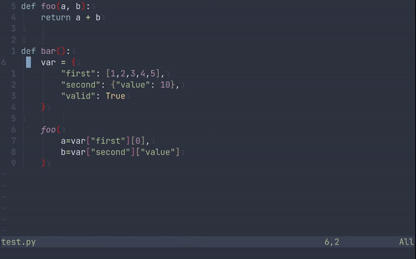

# Nvim-printer

**THIS PLUGIN IS UNDER DEVELOPMENT**

Nvim-printer is lua based plugin for [neovim](https://github.com/neovim/neovim).

It helps the development printing to the standard output the variable under the cursor.
The starting and ending positions (row, col) of the variable are obtained using [nvim-treesitter](https://github.com/nvim-treesitter/nvim-treesitter).
The final position of the plugin's output is also obtained with treesitter according to the current indentation of the file. 



## Installation
### Packer
```lua
packer {
  'fedeizzo/nvim-printer'
  requires = {
    {'nvim-treesitter/nvim-treesitter'}
  }
}
```

### Init
`init` function maps `<Leader>c` to the plugin's function.
```lua
:lua require'nvim-printer.main'.init()
```

## Supported languages
(List of [nvim-treesitter](https://github.com/nvim-treesitter/nvim-treesitter))
- [ ] bash
- [ ] beancount
- [ ] bibtex
- [ ] c
- [ ] c\_sharp
- [ ] clojure
- [ ] cmake
- [ ] comment
- [ ] commonlisp
- [ ] cpp
- [ ] css
- [ ] cuda
- [ ] d
- [ ] dart
- [ ] devicetree
- [ ] dockerfile
- [ ] dot
- [ ] eex
- [ ] elixir
- [ ] elm
- [ ] erlang
- [ ] fennel
- [ ] fish
- [ ] foam
- [ ] fortran
- [ ] fusion
- [ ] Godot (gdscript)
- [ ] Glimmer and Ember
- [ ] glsl
- [ ] go
- [ ] Godot Resources (gdresource)
- [ ] gomod
- [ ] gowork
- [ ] graphql
- [ ] hack
- [ ] haskell
- [ ] hcl
- [ ] heex
- [ ] hjson
- [ ] hocon
- [ ] html
- [ ] http
- [ ] java
- [ ] javascript
- [ ] jsdoc
- [ ] json
- [ ] json5
- [ ] JSON with comments
- [ ] julia
- [ ] kotlin
- [ ] latex
- [ ] ledger
- [ ] llvm
- [ ] lua
- [ ] make
- [ ] markdown
- [ ] ninja
- [ ] nix
- [ ] norg
- [ ] ocaml
- [ ] ocaml\_interface
- [ ] ocamllex
- [ ] pascal
- [ ] perl
- [ ] php
- [ ] phpdoc
- [ ] pioasm
- [ ] prisma
- [ ] pug
- [x] python
- [ ] ql
- [ ] Tree-sitter query language
- [ ] r
- [ ] rasi
- [ ] regex
- [ ] rst
- [ ] ruby
- [ ] rust
- [ ] scala
- [ ] scss
- [ ] sparql
- [ ] supercollider
- [ ] surface
- [ ] svelte
- [ ] swift
- [ ] teal
- [ ] tlaplus
- [ ] toml
- [ ] tsx
- [ ] turtle
- [ ] typescript
- [ ] vala
- [ ] verilog
- [ ] vim
- [ ] vue
- [ ] yaml
- [ ] yang
